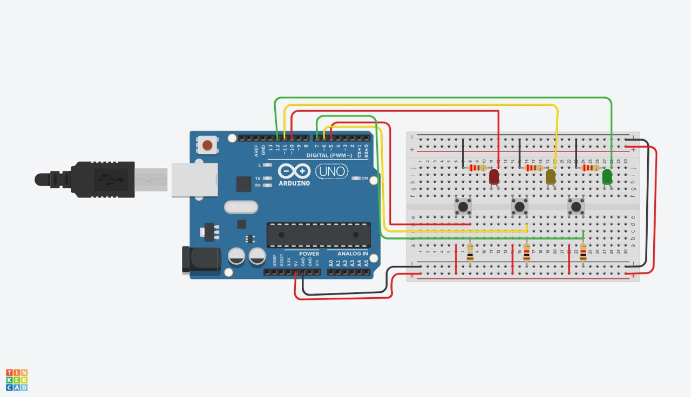

# arduin-led
This project showcases a basic control system using an Arduino board.
It involves three push buttons and three LEDs, where each button directly controls one LED.

# compenents
Arduino Uno
3- Push Buttons
3- LEDs
3- 220Ω Resistors[LEDs]
3-1kΩ Resistors [pull-down]
Breadboard and Jumper Wires

# How It Works
 • When a push button is pressed, the corresponding LED lights up.
 • When the button is released, the LED turns off.
This setup provides a simple demonstration of digital input and output with Arduino.

# ciecuit diagram

